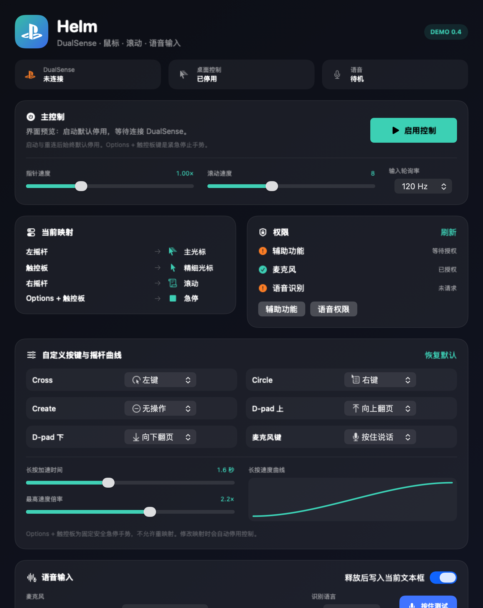

# Helm

Helm is an experimental macOS control center that turns a PlayStation, Xbox,
or Nintendo controller into one compact desktop controller.



## Controls

| Controller input | macOS action |
| --- | --- |
| Left stick | Main pointer movement |
| Touchpad | Precision pointer movement |
| Cross | Left click / hold to drag |
| Circle | Right click / hold to drag |
| Right stick up/down | Smooth scrolling |
| L2 / R2 | Brake / accelerate pointer and scrolling |
| D-pad up/down | Page navigation |
| Microphone button | Push to talk |
| Options + touchpad within two seconds | Emergency stop only |

Pointer speed is adjustable in the app. The left stick uses a radial dead zone
and nonlinear acceleration that ramps up while held, while touchpad movement is
deliberately slower and capped for precision. The acceleration duration and
maximum boost are configurable and shown as a live curve.

Any SDL-exposed controller button can be recorded as a single button or a
combination of up to four buttons, then mapped to clicks, page navigation, PTT,
or one of three configurable keyboard shortcuts. This includes the four paddle
positions exposed for controllers such as Xbox Elite and DualSense Edge. The
shortcut slots can invoke an external input method without bringing Helm to the
foreground. A slot may also be a held modifier-only action such as Command or
Control, with independent left/right selection for Command, Control, Option,
and Shift, so another input source can complete the chord. Recording or editing
a mapping temporarily suppresses injected actions without disabling the active
controller session. Mappings and motion settings persist across launches. The safety
chord is intentionally fixed, cannot be remapped, and never enables controls.

L2 acts like a racing-game brake and R2 acts like an accelerator. Their minimum
and maximum multipliers are configurable and apply to left-stick/touchpad
pointer movement and right-stick scrolling.

Input processing is locked to a 240 Hz high-priority active cadence. A
low-latency radial response floor, configurable response and smoothing
curves, elapsed-time integration, and fractional continuous-pixel scrolling keep
light stick input responsive without changing speed across variable frame
intervals. Helm reads the current left stick, right stick, and triggers on every
cadence tick, so motion no longer depends on how frequently a particular axis
happens to emit SDL events. Right-stick fractional scroll output is accumulated
and rounded symmetrically, avoiding a full-point startup impulse followed by a
visible repayment pause.

## Haptic feedback

Optional semantic haptics acknowledge discrete actions such as clicks, page
navigation, shortcuts, and PTT start/stop. They are off by default, use a
conservative 35% initial intensity, and never run continuously for pointer or
scroll movement. Helm checks SDL's whole-gamepad rumble capability at runtime;
adaptive-trigger effects are intentionally a separate future feature. See the
[haptic design and safety policy](docs/haptics.md).

## Safety model

- SDL-standard PS4/PS5, Xbox 360/One-class, Nintendo Switch Pro, and generic
  standard mappings are accepted; button labels follow each controller family.
- When a controller is already connected as Helm launches, controls
  automatically enable by default after Accessibility is confirmed. This is a
  configurable one-shot launch action, so a later reconnect does not override a
  manual stop. Sleep/timer gaps, permission loss, disconnect, app termination,
  and the emergency chord still release all held actions immediately.
- Accessibility, Microphone, and Speech permissions are requested only after an
  explicit action in the visible UI.
- Pending Speech callbacks are cancelled on emergency stop.
- Microphone and Speech permissions are requested sequentially, and an
  interrupted on-screen PTT test is cancelled instead of remaining stuck.
- Recognized text first uses the focused Accessibility text element, then uses
  Unicode keyboard events for the confirmed external target when dynamic web
  editors reject direct AX insertion or expose a generic accessibility role.
  Helm fixes the external process identity at PTT start, restores it before
  delivery, verifies that the focused Accessibility element belongs to that
  process, and
  only then posts the Unicode fallback through the global HID event path used by
  web/Electron editors. Secure Input and secure text
  fields are refused; the clipboard is never used as a fallback. Direct AX insertion is reported as confirmed;
  Unicode event delivery is explicitly reported as unconfirmed because the
  target application may ignore it. If the UI PTT action prevented an AX text
  snapshot at capture time, Helm may recapture the currently focused element
  only after the exact original process is frontmost again; an existing snapshot
  is never replaced by a later focus.

## Voice limitation

The controller microphone/share/capture button can be used as the PTT control.
Audio is captured from the macOS input explicitly selected in Helm. On the
target Mac, a wired DualSense currently enumerates as a 48 kHz USB input. Helm
recognizes that route and tolerates one bounded HID re-enumeration without
cancelling active recognition; Bluetooth controller audio is not used as a
music-safe input route. Controller PTT remains active when desktop mouse/key
injection is disabled, so the external text field can keep focus throughout.

Playback protection is enabled by default. If the system default input is a
Bluetooth headset microphone, Helm selects a built-in or USB input instead;
opening a classic Bluetooth microphone can switch the headset into its call
profile and interrupt or degrade music. The protection can be disabled
explicitly when that tradeoff is desired. Enabling protection during an active
Bluetooth capture immediately cancels that capture before switching the picker.

## Requirements

- macOS 14 or later
- Apple Command Line Tools or Xcode
- A DualSense / DualSense Edge, Xbox-compatible controller, or Nintendo Switch Pro Controller
- SDL3 3.4.12 macOS framework
- Sparkle 2.9.4 macOS framework

The current Demo is ad-hoc signed for local development. Real controller,
Accessibility, and speech behavior should be validated on the target Mac before
relying on it for everyday use.

When a completed transcript remains in Helm because the destination did not
accept automatic delivery, activate the intended external text field again,
return to Helm, and choose **重新发送到外部焦点**. The post-recognition
activation is consumed once, and the process PID plus launch time is checked on
every retry to reject PID reuse. The recovery action otherwise reuses the same
Accessibility, secure-input, and bounded-retry checks; it does not record audio
again or use the clipboard.

The public Demo update channel uses manually dispatched GitHub Releases with a
signed Sparkle appcast. Updates are verified before extraction, signed-feed
failures never expire into an unsigned fallback, and background checks remain
disabled. Its ad-hoc signature
is for testing and is not a substitute for Developer ID signing or Apple
notarization. See the [release and update contract](docs/release-and-updates.md)
for the separate formal-release gates.

## Build and install

Download the official SDL3 macOS framework, verify it, and place it in the
ignored local vendor directory:

```bash
curl -L \
  -o /tmp/SDL3-3.4.12.dmg \
  https://github.com/libsdl-org/SDL/releases/download/release-3.4.12/SDL3-3.4.12.dmg

echo "c77d36d9393bb5481e38d222b75a1a63ab16274457b3d18c63fef90aaf5fc93b  /tmp/SDL3-3.4.12.dmg" \
  | shasum -a 256 -c -

hdiutil attach /tmp/SDL3-3.4.12.dmg
mkdir -p macos-app/.vendor
ditto /Volumes/SDL3/SDL3.xcframework/macos-arm64_x86_64/SDL3.framework \
  macos-app/.vendor/SDL3.framework
hdiutil detach /Volumes/SDL3

curl -L \
  -o /tmp/Sparkle-2.9.4.tar.xz \
  https://github.com/sparkle-project/Sparkle/releases/download/2.9.4/Sparkle-2.9.4.tar.xz

echo "ce89daf967db1e1893ed3ebd67575ed82d3902563e3191ca92aaec9164fbdef9  /tmp/Sparkle-2.9.4.tar.xz" \
  | shasum -a 256 -c -

sparkle_dir=$(mktemp -d /tmp/helm-sparkle.XXXXXX)
tar -xf /tmp/Sparkle-2.9.4.tar.xz -C "$sparkle_dir"
ditto "$sparkle_dir/Sparkle.framework" macos-app/.vendor/Sparkle.framework
ditto "$sparkle_dir/LICENSE" macos-app/.vendor/Sparkle-LICENSE.txt
```

Then run:

```bash
macos-app/scripts/build-and-install.sh --launch
```

The script runs the deterministic control-math/audio tests plus an isolated SDL
virtual-gamepad analog-read integration test, compiles Swift and C with warnings treated as errors, embeds SDL3 and the pinned Sparkle framework,
applies a stable local-development ad-hoc requirement, and installs to
`~/Applications/Helm Demo.app`. Updates keep that top-level app directory in
place, transactionally replace only `Contents`, verify the installed copy, and
remove the temporary rollback immediately after success. Moving an older build onto this stable identity
can require one final Accessibility/Microphone/Speech grant; subsequent local
builds keep the same designated requirement at the same path. On the target Mac,
six observed updates from build 11 through build 17 each changed the app
CDHash while preserving the app-directory inode and designated requirement;
Accessibility, Microphone, and Speech all remained authorized after every
relaunch. That evidence is scoped to this local Demo identity and does not claim
the same behavior for a future Developer ID distribution.

The Demo embeds the dedicated public update key and a stable GitHub Releases
feed URL, requires pre-extraction verification, and permanently fails closed on
feed-signature errors. Until the first release is published, a manual update check may report
that no feed is available; background checks remain off. Public Demo releases
are ad-hoc signed and intended for testing. Formal release verification additionally
binds an exact Developer ID certificate and Team ID, checks both official SDL
and Sparkle archive hashes and signature-normalized embedded contents, verifies
embedded linkage and archive-sourced Sparkle tools, rejects any Mach-O outside
the exact main-plus-six-helper allowlist across the entire App Contents tree,
enforces exact main/nested entitlement policies, validates the stapled ticket, and
cryptographically verifies the ZIP and appcast against a reviewed prior-feed
SHA-256 anchor read from the same clean reviewed Git commit at preflight and
final verification.

## Privacy permissions

Helm does not request privacy permissions at launch. Use the visible permission
buttons when you are ready, complete the macOS System Settings flow, return to
Helm, and select **Refresh**.

## License

Helm source code is available under the [MIT License](LICENSE). SDL3 is a
separate dependency distributed under the zlib license; Sparkle is a separate
dependency distributed under the MIT license. Their binary frameworks are not
committed to this repository.
